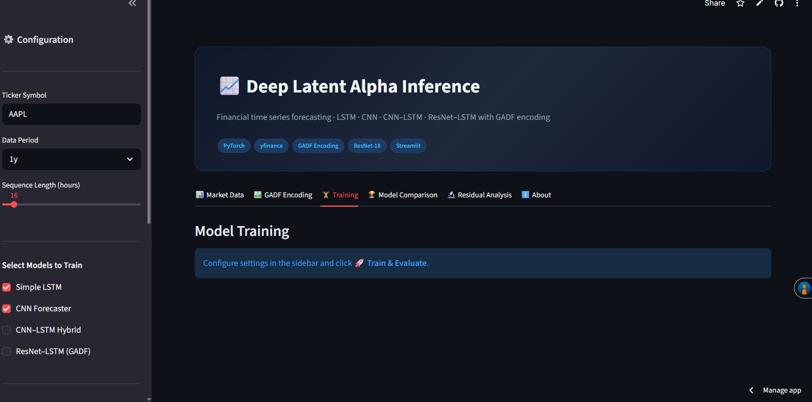
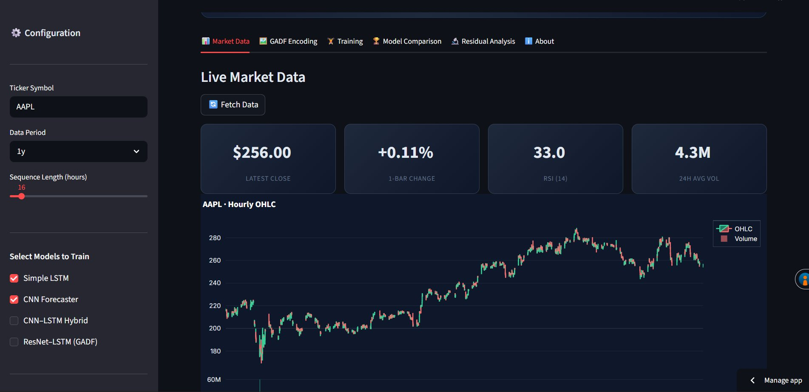
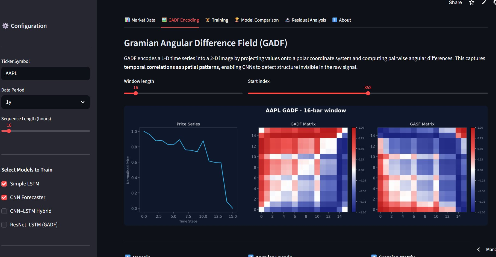
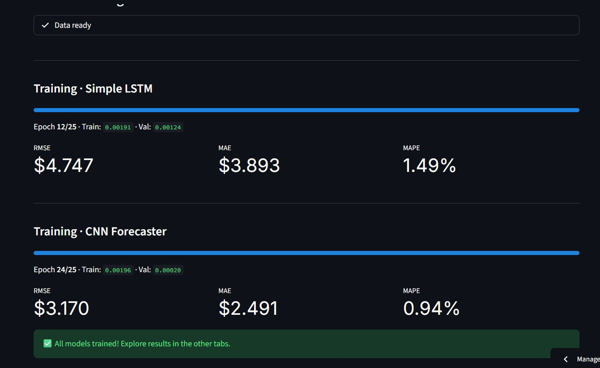
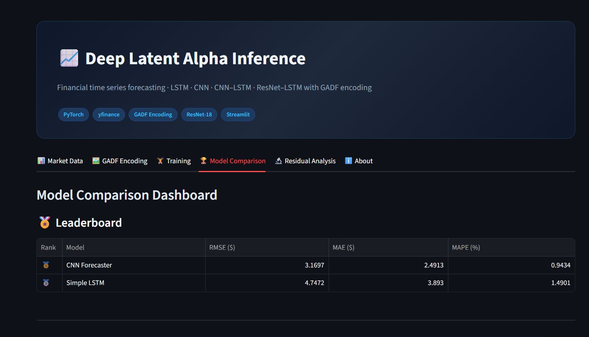
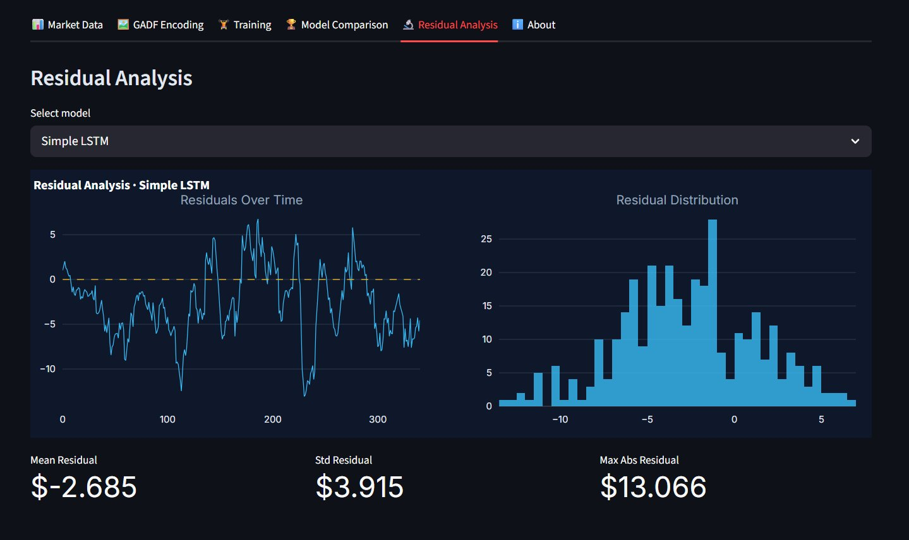
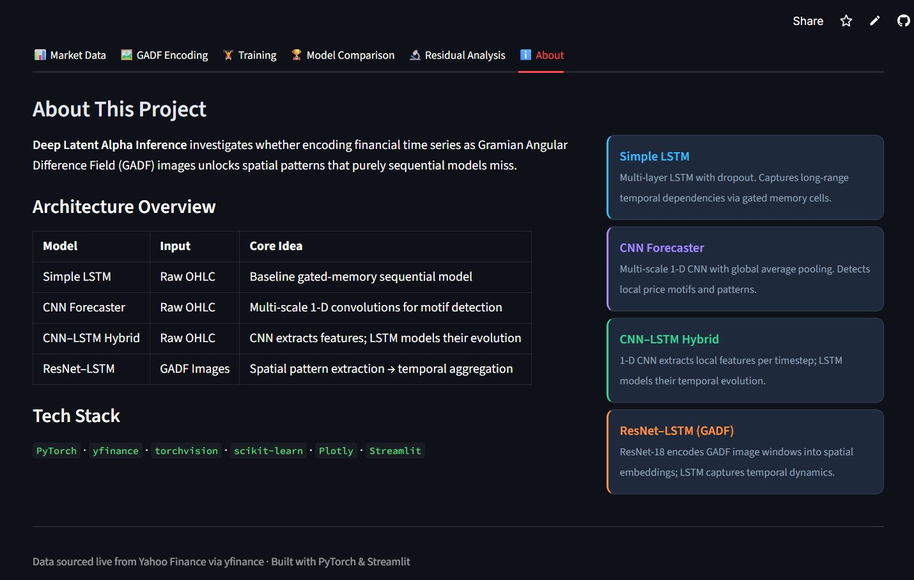

# 📈 Deep Latent Alpha Inference

> **Financial time series forecasting** using LSTM, CNN, CNN–LSTM, and ResNet–LSTM architectures with Gramian Angular Difference Field (GADF) image encoding on live hourly OHLC data — deployed as an interactive Streamlit dashboard.

<div align="center">

[](https://deep-latent-alpha-inference.streamlit.app/)
[](https://python.org)
[](https://pytorch.org)
[](LICENSE)

**[🌐 Try the Live App →](https://deep-latent-alpha-inference.streamlit.app/)**

</div>

---

## 📸 App Screenshots

### 🏠 Dashboard & Market Data

*Hero dashboard with live AAPL OHLC candlestick chart, RSI panel, and real-time KPI metrics (latest close, 1-bar change, RSI, 24h average volume)*

---

### 📊 Live Market Data Tab

*Fetches live hourly OHLC data from Yahoo Finance for any ticker. Displays interactive candlestick + volume chart with real-time KPI cards*

---

### 🖼️ GADF Encoding Visualiser

*Interactive GADF encoding view — shows the 1-D price series alongside its GADF and GASF matrix representations. Adjust window length and start index in real time*

---

### 🏋️ Model Training

*Live training dashboard with per-epoch progress bars, train/val loss display, and per-model RMSE / MAE / MAPE metrics shown as training completes*

---

### 🏆 Model Comparison Leaderboard

*Ranked leaderboard comparing all trained models on RMSE, MAE, and MAPE — with bar charts and overlay prediction plots*

---

### 🔬 Residual Analysis

*Per-model residual analysis: time-series scatter of prediction errors + distribution histogram, with mean / std / max-abs summary statistics*

---

### ℹ️ About

*Architecture overview table and per-model description cards with full tech stack*

---

## 🔍 Problem Statement

Standard LSTM models treat financial time series as purely sequential signals and can miss rich structural patterns embedded in price movements. This project investigates whether **encoding price windows as Gramian Angular Difference Field (GADF) images** and applying a pretrained ResNet-18 as a spatial feature extractor can surface patterns that sequential models alone cannot detect.

---

## 🏗️ Architecture Overview

```
Raw OHLC Data (hourly, via yfinance)
        │
        ├──► Sliding Window Sequences ──► SimpleLSTM
        │                              ──► CNNForecaster
        │                              ──► CNN–LSTM Hybrid
        │
        └──► GADF Image Encoding ──► ResNet-18 Encoder ──► LSTM ──► Price Forecast
```

| Model | Input | Approx. Params | Core Idea |
|---|---|---|---|
| **Simple LSTM** | OHLC sequences | ~200K | Multi-layer gated memory baseline |
| **CNN Forecaster** | OHLC sequences | ~150K | Multi-scale 1-D convolutions for motif detection |
| **CNN–LSTM Hybrid** | OHLC sequences | ~280K | CNN extracts local features → LSTM models their evolution |
| **ResNet–LSTM (GADF)** | GADF images | ~12M | Spatial pattern extraction → temporal aggregation |

---

## 🧠 GADF Encoding — How It Works

GADF converts a 1-D time series window into a 2-D image in three steps:

| Step | Operation | Formula |
|---|---|---|
| **1. Rescale** | Normalise the series to [-1, 1] | `x̃ᵢ = 2(xᵢ − min) / (max − min) − 1` |
| **2. Angular Encode** | Map each value to a polar angle | `φᵢ = arccos(x̃ᵢ)` |
| **3. Gramian Matrix** | Compute pairwise angular differences | `GADF[i,j] = sin(φᵢ − φⱼ)` |

The resulting image encodes **pairwise temporal correlations as spatial structure**, with time ordering preserved along the diagonal. This makes CNNs and ResNets effective as feature extractors over financial time series.

---

## 📈 Results (AAPL, 1y hourly, seq_len=16)

| Rank | Model | RMSE ($) | MAE ($) | MAPE (%) |
|---|---|---|---|---|
| 🥇 | CNN Forecaster | 3.170 | 2.491 | 0.94 |
| 🥈 | Simple LSTM | 4.747 | 3.893 | 1.49 |

> Results vary by ticker, training period, hyperparameters, and random seed. Enable all four models for a full comparison.

---

## 🚀 Quick Start

```bash
# 1. Clone the repo
git clone https://github.com/amankumarsingh23/deep-latent-alpha-inference
cd deep-latent-alpha-inference

# 2. Install dependencies
pip install -r requirements.txt

# 3. Launch the app
streamlit run app.py
```

Then open [http://localhost:8501](http://localhost:8501) in your browser.

---

## 📊 App Features

- **Live data** — fetches any ticker directly from Yahoo Finance via `yfinance`; supports `6mo`, `1y`, `2y` periods
- **Technical indicators** — SMA, EMA, Bollinger Bands, RSI, MACD computed automatically
- **GADF / GASF visualiser** — interactive window-length and start-index sliders with instant re-render
- **4 model architectures** — all trained with a shared engine: AdamW optimiser, Huber loss, ReduceLROnPlateau scheduler, early stopping
- **Training dashboard** — live epoch progress, per-step loss display, per-model metrics
- **Model comparison** — RMSE / MAE / MAPE leaderboard, grouped bar charts, overlay prediction plots
- **Residual analysis** — temporal scatter + histogram per model, with summary statistics
- **Dark-themed UI** — fully styled with Inter font, custom CSS, and Plotly dark charts

---

## 📁 Project Structure

```
deep-latent-alpha-inference/
├── app.py               # Streamlit dashboard — single-file, self-contained
├── requirements.txt     # Python dependencies
├── packages.txt         # System packages (libgomp1 for PyTorch)
└── screenshots/         # App screenshots for README
```

> All model architectures, training logic, data utilities, GADF encoding, and plotting helpers are inlined inside `app.py` for zero-friction Streamlit Cloud deployment.

---

## 🛠️ Tech Stack

| Category | Libraries |
|---|---|
| Deep Learning | `torch`, `torchvision` (ResNet-18) |
| Data | `yfinance`, `pandas`, `numpy` |
| ML Utilities | `scikit-learn` (normalisation, metrics) |
| Visualisation | `plotly`, `matplotlib` |
| App Framework | `streamlit` |

---

## ⚙️ Configuration

All settings are controlled from the sidebar — no config files needed:

| Parameter | Options | Default |
|---|---|---|
| Ticker Symbol | Any valid Yahoo Finance ticker | `AAPL` |
| Data Period | `6mo`, `1y`, `2y` | `1y` |
| Sequence Length | 12–72 hours | 24 |
| Models | Any combination of the 4 architectures | LSTM + CNN |
| Max Epochs | 10–60 | 25 |
| Batch Size | 32–256 | 64 |
| Learning Rate | 1e-4 to 2e-3 | 1e-3 |
| Early Stop Patience | 3–15 epochs | 7 |

---

## 📄 License

MIT License — see [LICENSE](LICENSE)

---

<div align="center">

**[🌐 Open Live App](https://deep-latent-alpha-inference.streamlit.app/)** · Built with PyTorch & Streamlit · Data from Yahoo Finance

</div>
